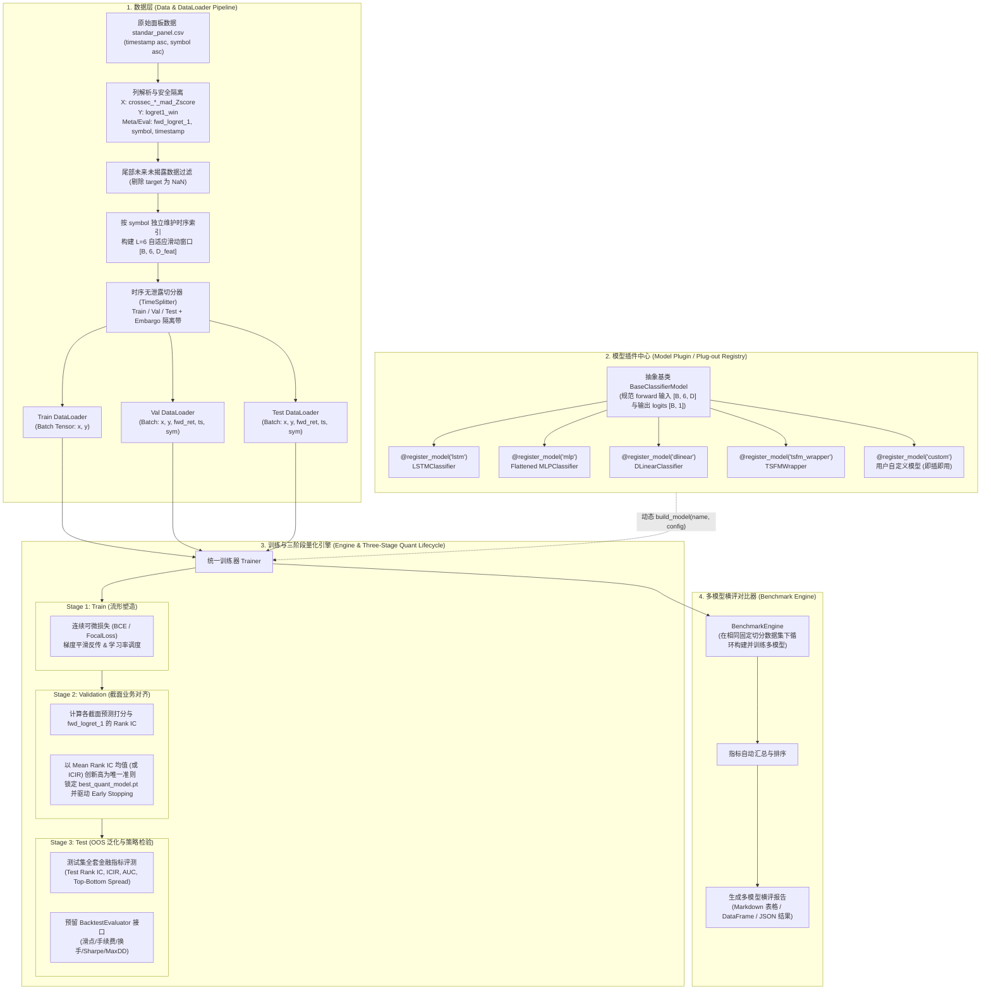

# `crossec_forecast` 金融截面/时序预测框架设计方案 (v2.4)

本库专门针对 [`cross_section_enrich`](https://github.com/GeekChomolungma/cross_section_enrich) 生成的 `standar_panel.csv`（或未来 ClickHouse 导出）金融面板数据，提供**高通用性 DataLoader**、**模型热插拔 (Plugin/Plug-out)** 以及**多模型横向性能对比 (Benchmark)** 的完整工程流水线。

---

## 1. 机器学习与量化端到端全景架构 (End-to-End System Architecture)



---

## 2. 量化预测三阶段严谨训评范式 (Three-Stage Quant Workflow)

| 阶段 | 核心监控指标 | 核心逻辑与实现机制 |
| :--- | :--- | :--- |
| **1. Train** | 连续分类损失 (`loss`)、学习率、梯度范数 | 专注于连续可微的交叉熵/BCE损失，让神经网络建立起输入特征到条件后验概率的高维流形映射，保证梯度平滑反传。 |
| **2. Validation** | **截面 Rank IC 均值** (`val_mean_rank_ic`) 或 `val_ic_ir` | **剥离分类 Loss 假象**：直接以截面预测排序能力为唯一监控标尺。只要截面相对大小关系最好（排序单调性最强），即保存该 Epoch 的模型权重（`best_model.pt`）并作为早停依据，避免因抠分类 Loss 而破坏头部相对排序。 |
| **3. Test (OOS)** | `test_rank_ic`, `test_ic_ir`, `top_bottom_spread` 以及预留的真实交易回测指标 | 评估模型在未来无偏样本下的截面排序与分层收益能力。预留 `BacktestEvaluator` 扩展接口，便于后续接入滑点、手续费、换手率冲击、行业中性化、夏普比率（Sharpe）、最大回撤（Max Drawdown）等交易模拟计算。 |

---

## 3. 数据集规范与面板特性 (Data Specification)

### 3.1 排序结构与物理布局
原始 `standar_panel.csv` 严格采用金融量化经典双重排序结构：
$$\text{Index Order: } (\text{timestamp} \uparrow, \; \text{symbol} \uparrow)$$
- **同一时间戳聚拢**：每一时刻 $t$ 聚合当前时刻所有有效标的（按字母序排列）；
- **时间单调递增**：全局按 $t_0, t_1, \dots, t_T$ 严格单调递增。

### 3.2 字段类别划分
| 字段类别 | 字段列表/规则 | 处理逻辑与用途 |
| :--- | :--- | :--- |
| **主键与时空索引** | `timestamp`, `symbol`, `close_time` | 构建时序与截面索引定位。 |
| **原始行情字段** | `open`, `high`, `low`, `close`, `volume`, `quote_volume`, `count`, `taker_buy_*` | 原始行情（不作为特征，备用回测计算）。 |
| **前视关键收益** | `fwd_logret_1`, `fwd_logret_3`, `fwd_logret_6` | $\log(close[t+n]) - \log(close[t])$，**严禁输入模型**，用于 Val/Test 阶段计算真实 Rank IC 与收益差。 |
| **模型输入特征 (X)** | `crossec_*_Zscore` 结尾的特征列（共约 24+ 列） | 经 MAD 去极值与截面无量纲化后的 Z-score，为模型纯净输入。 |
| **训练预测目标 (Y)** | 当前主目标：`logret1_win`（0=跑输中位数，1=跑赢中位数）<br>（后续版本预留：`logret3_win`, `logret6_win`） | 二分类任务目标 (0/1 Classification) 或截面相对强弱打分。 |

### 3.3 样本构造与边缘情况处理
1. **尾部未揭露样本剔除**：训练/验证/测试默认过滤掉 `logret1_win` 为 `NaN` 的尾部最新样本；提供 `is_inference=True` 保留最后实盘预测样本。
2. **标的上市时间不对齐自适应**：按 `symbol` 独立维护历史滑动窗口。只要标的在时刻 $t$ 具有连续 6 步历史（$L=6$）且标签有效，即可构建样本 $(X_{s, t} \in \mathbb{R}^{6 \times D}, y_{s, t})$。

---

## 4. 目录结构与模块划分

```text
crossec_forecast/
├── __init__.py
├── configs/
│   ├── __init__.py
│   └── default_config.py      # 数据、训练、早停及评估超参数定义
├── data/
│   ├── __init__.py
│   ├── dataset.py             # 面板时序滑动窗口 Dataset (自适应 L=6 & NaN 过滤)
│   ├── dataloader.py          # build_dataloaders 通用构建接口
│   └── splitters.py           # 时间序列严格切分 (带 Embargo 隔离)
├── models/
│   ├── __init__.py            # 模型自动扫描与注册导出
│   ├── base.py                # BaseClassifierModel 抽象基类
│   ├── registry.py            # @register_model 与 build_model 工厂
│   ├── lstm.py                # LSTM 模型插件
│   ├── mlp.py                 # Flattened MLP / Linear 模型插件
│   ├── dlinear.py             # DLinear 时序模型插件
│   └── tsfm_wrapper.py        # TSFM 扩展通用适配器
├── engine/
│   ├── __init__.py
│   ├── trainer.py             # 统一 Trainer (基于 Val Mean Rank IC 进行早停与权重保存)
│   └── losses.py              # 二分类与连续可微损失 (BCEWithLogits, FocalLoss 等)
├── eval/
│   ├── __init__.py
│   ├── metrics.py             # 截面 Rank IC, ICIR, AUC, Accuracy, Top-Bottom Spread
│   ├── backtest.py            # 预留真实交易回测与摩擦成本评估接口 (BacktestEvaluator)
│   └── benchmark.py           # BenchmarkEngine 横向横评对比器
├── examples/
│   ├── mock_panel_data.py     # 模拟生成与 standar_panel.csv 同结构的面板测试数据
│   └── run_benchmark.py       # 一键运行多模型横评示例
└── tests/
    ├── test_data.py           # 测试数据加载、窗口构造、NaN 过滤与无泄露切分
    ├── test_models.py         # 测试模型注册机制与输入输出维度
    ├── test_trainer.py        # 测试基于 Rank IC 的早停与单模型训练
    └── test_benchmark.py      # 测试多模型横评与报告生成
```

---

## 5. 验证计划 (Verification Plan)

1. **环境与依赖确认**：确保 PyTorch、Pandas、Numpy、Scipy 等环境完备。
2. **数据与样本构建验证**：
   - 验证 `(timestamp, symbol)` 结构的面板数据切片、历史 $L=6$ 提取、尾部 `NaN` 剔除与 Embargo 切分。
3. **基于 Rank IC 的早停与 Checkpoint 测试**：
   - 验证 Trainer 是否严格以 `val_mean_rank_ic` 创新高为依据保存权重与早停。
4. **多模型横评与报告输出验证**：
   - 运行 `run_benchmark.py`，输出 LSTM vs MLP vs DLinear 在测试集上的全面指标（Test Rank IC, ICIR, AUC, Top-Bottom Spread）及横评对比报表。

